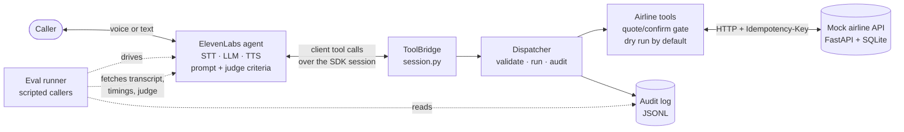
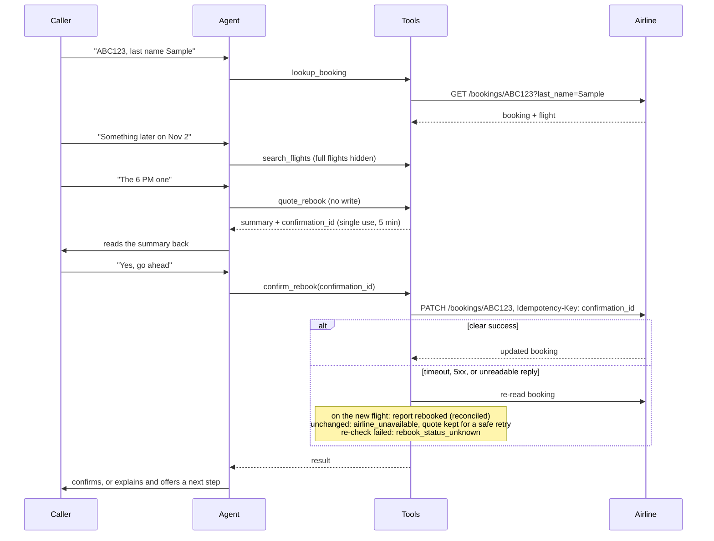

# Solution design: WhiskerSync Air rebooking agent

> **Simulated engagement** for a fictional airline; see [discovery.md](discovery.md). The design below is what this repo implements. The last sections describe what I'd change for production.

## Architecture

- **The agent** (ElevenLabs) handles speech-to-text, the LLM, and text-to-speech. It's defined in code (`config.py`) and created or updated with `make agent`.
- **The tools run in my process** as SDK client tools, not as webhooks. That keeps the sandbox local and keeps the audit log and dry-run switch on my side.
- **The airline is reached over HTTP**, the way a real customer integration would be, which is what makes fault injection possible.

## A rebooking, step by step

## Safety controls

| Control | Why |
|---|---|
| **Quote → confirm gate** with a single-use, expiring id | The only write needs a fresh, specific, caller-approved quote |
| **Read-back and explicit yes** (prompt and judge criterion) | Consent is spoken, and graded on every call |
| **Dry run unless `DRY_RUN=false`** | A misconfiguration fails safe |
| **Idempotency key** on the write | A retry can never apply twice, even if the first request lands late |
| **Strict argument checks**; ids must be alphanumeric | The model's arguments are untrusted input (blocks `../` path tricks) |
| **Audit line for every call** | Every action, including rejected ones, can be reconstructed |
| **Stock voices only**; provisioning refuses others | No cloned or third-party voices |
| **Cost guard and default-off live tests** | Evals can't run on an unmeasured, more expensive model, or start by accident |

## Failure handling (summary)

| Situation | Behaviour |
|---|---|
| Airline down, 5xx, 429, timeout, broken reply | `airline_unavailable`, spoken plainly, audited |
| Confirm failed but definitely didn't apply | Quote kept; the same id can be retried until it expires |
| Confirm reply lost but the change applied | Re-checked and reported as `rebooked` |
| Outcome can't be determined | `rebook_status_unknown`: the agent looks the booking up and doesn't confirm again |
| Flight filled up between quote and confirm | `flight_full`; the quote is used up |

The full table, with tests, is in the m4 README, *Resilience*. These behaviours were found and checked with the fault-injection harness (`harness/faults/`).

## Evaluation and observability

- **Six scripted scenarios:** happy path, wrong last name, full flight, caller declines, out of scope, different route. Each is checked by **rules** (which tools were called and with what outcome, the final booking, dry run) and by **ElevenLabs' judge** against four criteria. **All six pass live.**
- **Latency, p50/p95 per stage**, from ElevenLabs' per-turn metrics (small samples, measured during development):

  | Stage | p50 | p95 | Source |
  |---|---|---|---|
  | `stt` (speech-to-text) | 52 ms | 105 ms | Voice session |
  | `llm` (spoken reply, time to first output) | 188 ms | 269 ms | Text session |
  | `llm_tool` (choosing a tool call) | 438 ms | 629 ms | Text session |
  | `tts` (time to first audio) | 89 ms | 91 ms | Text session |
  | `e2e` (caller quiet → first agent audio) | 1,033 ms | 1,267 ms | Text session |

  The single voice session had speaker echo, so I'm not quoting its `e2e`. A clean run with headphones is the next measurement.

## Path to production

| Area | In this repo | In production |
|---|---|---|
| Tool execution | SDK client tools on my machine | **Server tools (webhooks)** behind authentication, so calls don't depend on a client process |
| Telephony | SDK sessions | A phone number on the ElevenLabs platform or via a telephony provider; call recording policy |
| Airline system | Mock FastAPI + SQLite | The customer's booking API. **Idempotency-key support is a requirement**; otherwise a reconciliation job with their team |
| Identity | Code + last name | Per the customer's risk policy, possibly with an extra factor |
| PII | Synthetic data | Retention and region settings; redaction in logs |
| Audit log | Local JSONL | A central, append-only store with retention |
| Hand-off | None | Warm transfer to a human, carrying the summary and audit trail |
| Monitoring | Eval runs plus a latency report | Dashboards for containment, wrong-change rate (alert on any), p95 `e2e`, error codes |

## Rollout

1. **Dry run in production traffic** (shadow): the agent handles calls, never writes, and humans complete the change. Compare outcomes.
2. **Live for a small share** of rebooking calls, with every confirm reviewed after the fact.
3. **Scale up** as containment holds and the wrong-change rate stays at zero, re-running the eval suite on every prompt or tool change.

## Risks

| Risk | Mitigation |
|---|---|
| Agent changes a booking without consent | Gate, read-back, judge criterion, dry run first, audit review |
| Backend outage at peak | Speakable errors, safe retries, hand-off |
| Prompt or model change degrades behaviour | Eval suite as a regression gate; agent config in code, reviewed like code |
| Cost drift | Measured per-second rates, cost guard, a dashboard on credits per call |
| Echo or noisy lines in voice | Headphones in testing; telephony echo cancellation in production |
